# Linux操作系统（大数据基础）

# 学习目标

* Linux系统概述
* Linux系统的安装和体验
* Linux的网络配置和连接工具
* Linux的目录结构
* Linux的常用命令
* Linux的VI/VIM编辑器

# 一、操作系统概述

## 计算机分类

计算机一般分为个人计算机（笔记、台式机）与 企业级服务器（1U、2U、机柜、塔式、刀片）两种形式。

## 计算机组成

计算机资源分为2 部分：==硬件资源、软件资源==

硬件资源：所谓的硬件资源就是看得见、摸得着的


> 在实际工作中，为软件资源提供硬件保障


软件资源：看得见、摸不着（如QQ、Wechat、WPS）

思考问题：操作硬件，软件有响应。操作软件，硬件也有响应。


思考：软件可以操作硬件（听音乐）、硬件也可以操作软件（玩游戏，人物的移动），它们之间是如何交互的呢？

答：主要就是==由于操作系统==，可以这么理解操作系统是软硬件之间的桥梁。

## 操作系统概述

操作系统（Operating System，简称OS）是管理和控制计算机硬件与软件资源的计算机程序，是直接运行在“裸机”上的最基本的系统软件，任何其他软件都必须在操作系统的支持下才能运行。

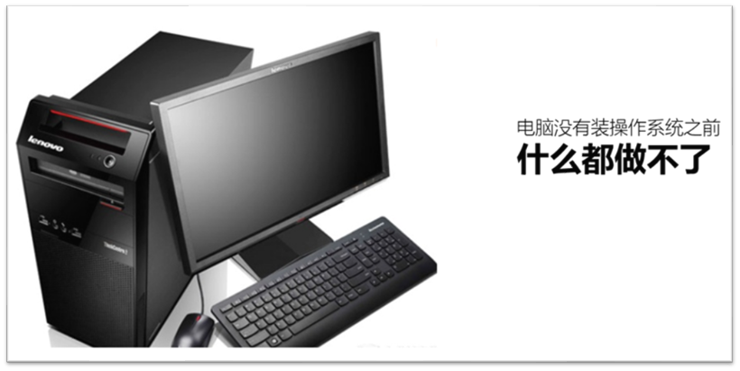

## 操作系统分类

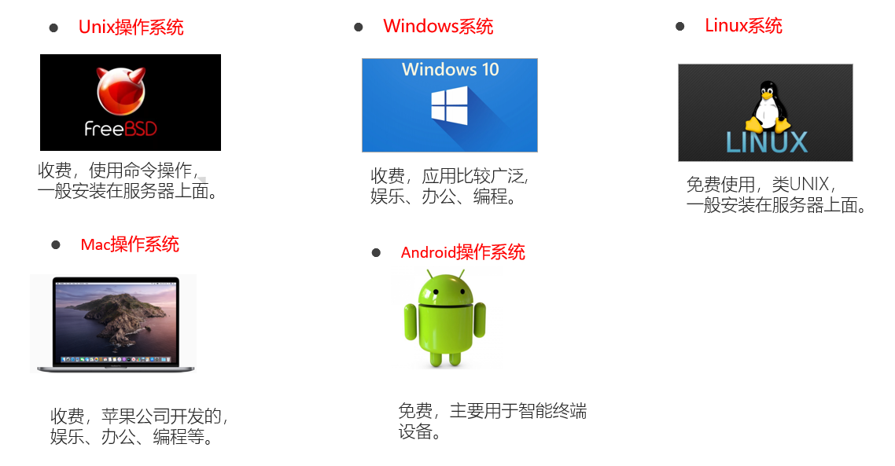

由于Linux是开源免费的，而且相比Windows/Mac更加安全、稳定。所以大数据组件都是基于Linux系统安装的，所以，Linux操作系统是我们大数据学习的必备技能。

Windows操作系统：收费、闭源操作系统

Unix操作系统：目前常用于Mac苹果电脑或者少量服务器，收费、闭源操作系统

Linux操作系统：开源、免费的操作系统

## 小结

知道计算机的组成部分

知道为什么要学习Linux操作系统

# 二、Linux操作系统概述

## Linux起源

Linux创始人——林纳斯 · 托瓦兹 => Linus =>  Linux

Linux 诞生于1991年，作者上大学期间实现的 => 发布学校FTP => Linux

Linux的特点：开源、免费、拥有最为庞大的源码贡献者 =》 GNU/Linux

Linux的吉祥物是企鹅（因为林纳斯小时候被企鹅咬过，印象深刻）=》Git


## Linux 的含义

狭义：由Linus 编写的一段内核代码。

广义：广义上的Linux 是指由Linux内核衍生的各种Linux发行版本。

## Linux发行版

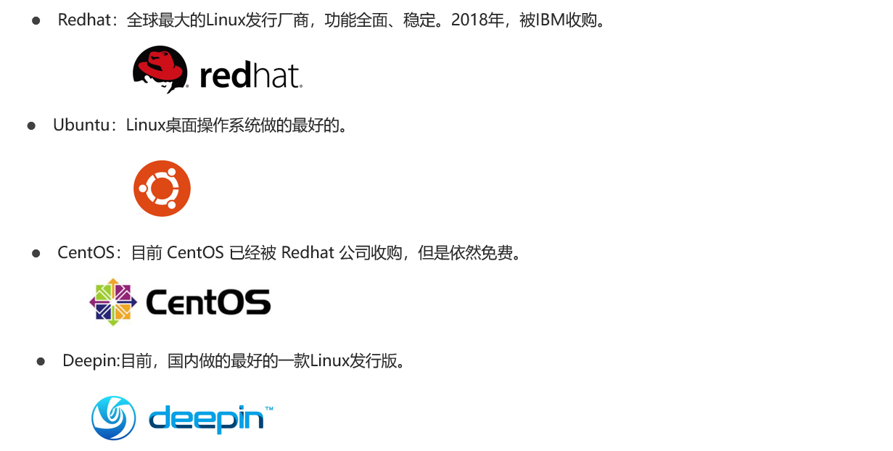

## 小结

了解Linux的含义

知道Linux主流的发行版

# 三、虚拟机与Linux系统安装

## 系统的安装方式

Linux操作系统也有两种安装方式：① 真机安装 ② 虚拟机安装

## 虚拟机概念

什么是虚拟机？

虚拟机，有些时候想模拟出一个真实的电脑环境，碍于使用真机安装代价太大，因此而诞生的一款可以模拟操作系统运行的==软件==。

虚拟机目前有2 个比较有名的产品：==vmware 出品的vmware workstation==、oracle 出品的virtual Box。

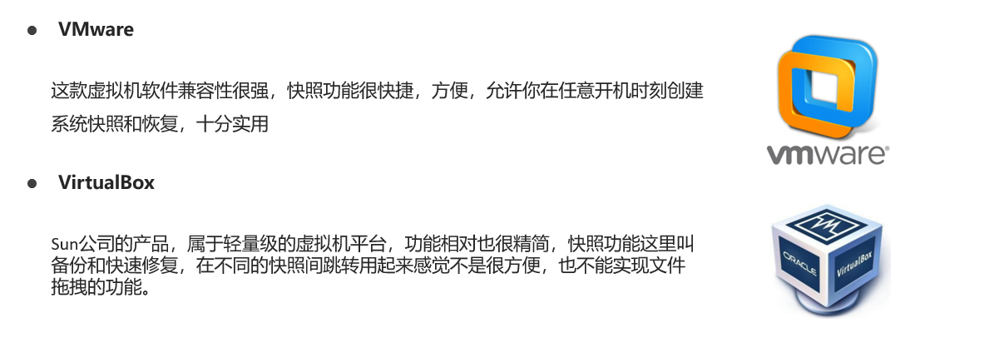

## 虚拟机的安装

> 强调：安装后尽量不要卸载，否则后果自负！！！


软件没有什么过多的注意事项，直接双击软件包进行安装即可。但是需要特别注意：当VMware软件安装完毕后，在计算机的网络中会出现两张虚拟网卡（VMnet1和VMnet8）


> 注意：这个软件安装完成后，尽量不要卸载，以为会有残留！！！

## Linux系统安装

第一步：解压BigData下面的node1/node2/node3


第二步：找到解压目录中的node1.vmx

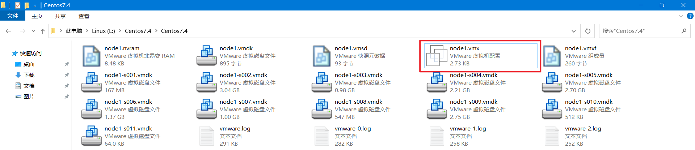

第三步：启动操作系统

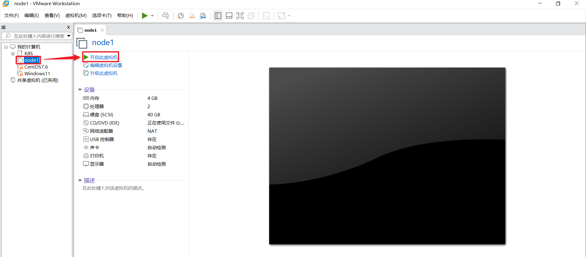

选择我已移动该虚拟机

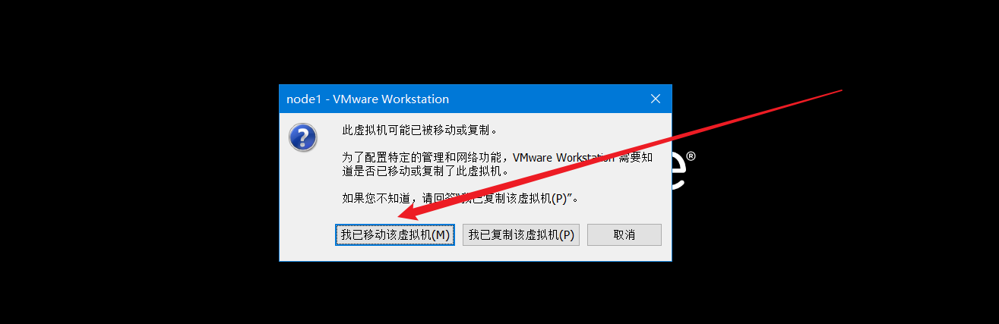

输入默认账号：root（超级管理员），默认密码：123456

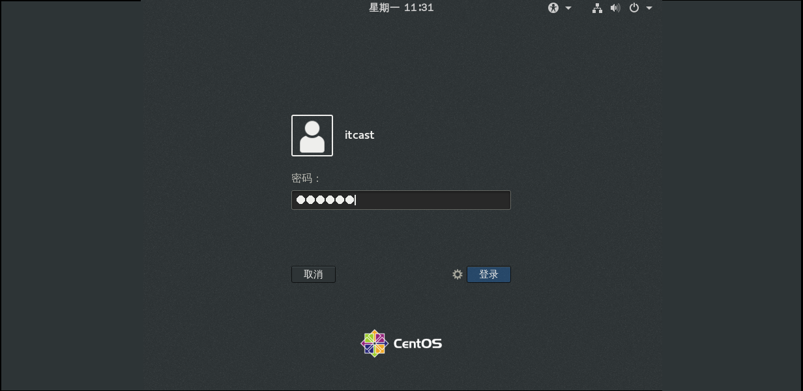

单击登陆，进入CentOS7操作系统，如下图所示：


## 常见问题汇总

① 同时启动3台机器，提示内存不足？

答：由于计算机的内存本身只有8G左右，但是每个虚拟机需要占用4G内存，所以最少需要12GB内存才能启动3台虚拟机。

注：如果无法加大内存，就只能使用云平台了。条件允许，建议加大内存。

② 输入密码总是提示验证不正确？

答：由于Vmware虚拟机会自动关闭NumLock键，所以在输入密码时，建议采用字母上面的数字键盘，不要使用小键盘。

③ 如何在Windows与Linux系统之间切换呢？

答：如果想从Windows中进入Linux系统，使用鼠标在Linux界面按一下就可以自动进入Linux操作系统了；如果想从Linux系统切换回Windows系统，则可以使用快捷键`Ctrl + Alt`。

# 四、Linux连接工具MX使用

## 为什么要使用远程连接工具？

答：因为一般的大数据的服务器都是放在机房的，我们不可能每天都跑到机房里去操作这些机器。所以，我们需要使用远程工具，通过网络连接到机房里的机器。

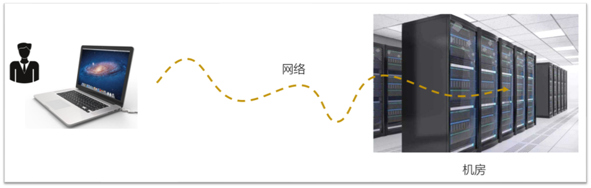

## 虚拟机网络配置

我们需要远程连接虚拟机，如果使用随机IP我们再重启或更改网络环境后，IP会随机变化，需要频繁修改网络连接配置，为方便学习，我们将其修改为固定IP。

node1 => 192.168.88.161

node2 => 192.168.88.162

node3 => 192.168.88.163

除了以上服务器的IP以外，我们还需要配置虚拟机的IP地址，否则无法实现远程连接。

远程工具 => ==经过VMware路由器== => 转发网络请求 => node1/node2/node3

配置如下：


选择NAT模式，修改子网IP为指定网段，此处IP设置为192.168.88.0，点击应用。

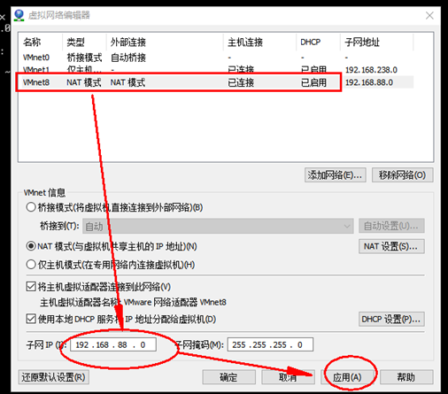

选择DHCP设置，将起始IP设置为192.168.88.1，终止IP设置为192.168.88.254，点击确定。

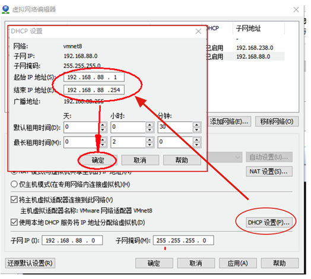

点击NAT设置，将网关IP设置为192.168.88.2，点击确定后，返回上一级点击确定，设置生效。

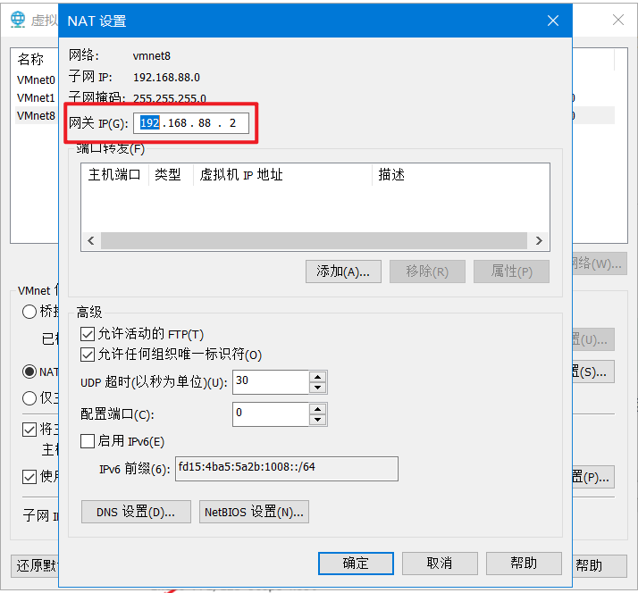

## 获取Linux操作系统IP地址

① 打开终端

② 在终端中，输入一个命令：`ip 空格 a`命令

> ip命令，a是一个参数，代表all，显示所有网卡的IP信息

③ 查看一个叫做ens33网卡的IP地址，这个地址叫做物理IP或者简单理解就是你插网线那个网卡的IP地址

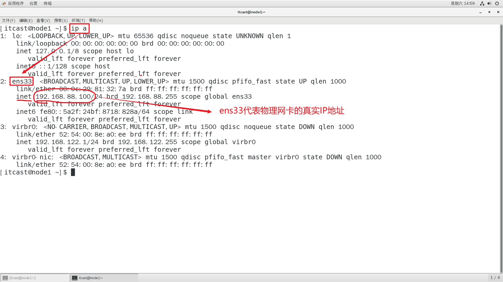

④ 在Windows操作系统中，远程测试一下这个IP地址是否可以连接（`ping命令`）

Windows电脑：`Windows键 + R`，输入`cmd`就可以打开DOS窗口了

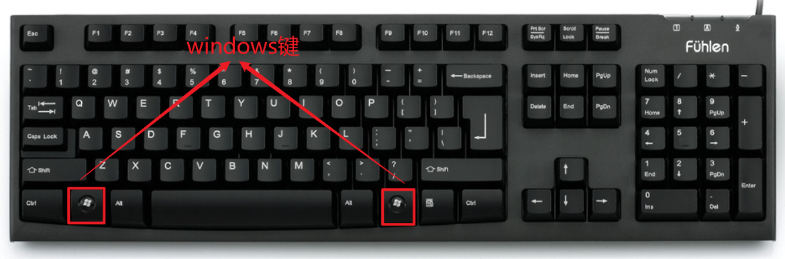


## 聊一聊Linux系统账号

问题：是不是有了IP地址，我们可以连接Linux操作系统了

答：IP只能保障两台计算机互相通信，如果想进行连接，除了有Linux的IP地址以外，还需要一个Linux的账号与密码。

账号一般分为两大类：① 普通账号（如itcast账号） ② 超级管理员（如root账号）

① 普通账号作用：一般可以用于登录操作系统，可以对自己的家目录（文件夹）进行管理

② 超级管理员作用：包括系统管理、所有用户的管理、软件的安装卸载、包括网络的配置等等，都可以通过root超级管理员进行实现。

咱们已经安装好的系统，可以通过itcast或者root账号进行管理。

默认情况下，Linux系统中的两个账号（itcast与root）密码都是`123456`

> 在学习阶段，推荐使用root账号进行远程管理。但是操作时一定要特别小心。

问题：如何使用命令从itcast普通账号切换到root管理员账号

答：可以使用`su`命令

```powershell
[itcast@node1 ~]$ su - root
密码：输入123456即可（但是输入的字符你看不见）

说明：以上命令的主要功能是从itcast普通账号切换到root超级管理员，要输入密码。
-横岗说明：-横岗在Linux操作系统中代表，切换用户的同时，把当前位置也切换到root管理员的家目录

[itcast@node1 ~] : 波浪线代表itcast的家
[root@node1 ~] : 波浪线代表root的家
```

## 安装MX远程连接软件

MX是一款强大的远程终端连接工具。可以用于远程连接Linux系统，通过远程方式执行命令完成任务。

建立连接：


参数配置：

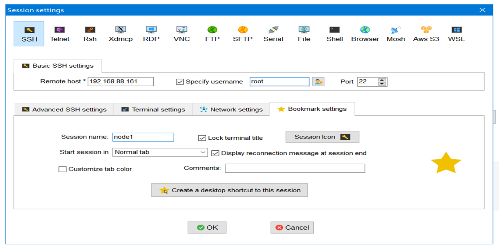

## 小结

为什么需要MX软件？

MX连接Linux服务器需要哪些参数？

# 五、Linux的目录结构（易错）

## Linux目录与Windows目录区别

Linux的目录结构是一个树型结构
Windows 系统 可以拥有多个盘符, 如 C盘、D盘、E盘
Linux 没有盘符 这个概念, 只有一个根目录 /, 所有文件都在它下面


## 常见目录介绍（记住重点）

| 目录      | 作用                                                         |
| --------- | ------------------------------------------------------------ |
| ==/bin==  | 二进制命令所在的目录(普通命令 => 普通用户itcast和超级管理员root) |
| /boot     | 系统引导程序所需要的文件目录，相当于Windows中的C盘           |
| /dev      | /device缩写，设备文件目录，磁盘，光驱 => /dev/sr0            |
| ==/etc==  | 系统配置文件目录，启动程序，几乎所有的软件都会把自己的配置文件安装在/etc中 |
| ==/home== | 普通用户的家目录，默认用户数据存放目录，itheima账号 => /home/itheima文件夹 |
| /lib      | 共享库文件和内核模块存放目录，软件安装、运行依赖库文件.a、.so文件 |
| /mnt      | 临时挂载储存设备的挂载点，插入u盘、移动硬盘 => 先挂载 => /mnt中访问 |
| /opt      | 额外的应用软件包， 安装qq、游戏、wps办公软件                 |
| /proc     | process进程目录，操作系统运行时，进程信息和内核信息存放在这里 |
| ==/root== | Linux超级权限用户root的家目录，超级管理员root => /root       |
| ==/sbin== | 和管理系统相关的命令，【超级管理员用】，s = super超级        |
| ==/tmp==  | 临时文件目录，这个目录被当作回收站使用                       |
| ==/usr==  | 用户或系统软件应用程序目录，类似Windows中的Program files     |

① 普及概念：`用户的家目录`

普通用户：itcast，普通用户的家 => /home，如itcast家目录 => /home/itcast文件夹

超级管理员：root，超级管理员的家 => /root

② 普及概念：`系统配置文件目录`

/etc ：与操作系统相关，系统软件相关，比如网卡配置 => 88.100 ~ 88.200

③ 普及概念：`/tmp目录`

临时文件目录，类似Windows中的垃圾回收站。

④ 普及概念：`/usr目录`

Linux系统中的程序目录，安装软件、程序默认都会自动安装到此目录，类似Windows中的Program files文件夹

## 小结

了解Linux系统的目录结构

能够说出几个重点目录的作用

# 六、Linux常见命令（重点中重点）

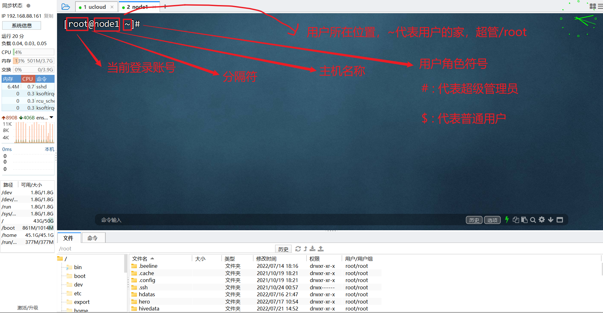

## 命令结构

```powershell
command [-options] [parameter]

说明:
command : 命令名, 相应功能的英文单词或单词的缩写
[-options] : 选项, 可用来对命令进行控制, 也可以省略
parameter : 传给命令的参数, 可以是 零个、一个 或者 多个
```

命令有三种情况：

① 只有命令，没有选项也没有参数

② 除了命令以外，还有选项，但是没有参数

③ 除了命令以外，还要有选项和参数

## ls命令

 作用 ：ls 是英文单词list show的简写, 其功能为列出目录的内容，是用户最常用的命令之一

格式

```powershell
ls [选项] [参数=>路径]
```

ls常用选项

| **选项** | **含义**                                              |
| -------- | ----------------------------------------------------- |
| **-a**   | all所有, 显示指定目录下所有子目录与文件, 包含隐藏文件 |
| **-l**   | list，以列表方式显示文件的详细信息                    |
| **-h**   | 配合 -l 以人性化的方式显示文件大小（文件大小 + 单位） |

案例演示：

```powershell
ls           #查看当前目录内容 (缺点: 隐藏文件看不到,以 .开头的文件) ！
ls -a        #查看当前目录内容 ,包括隐藏文件 
ls –al       #查看目录内容的详细信息(查看文件类型、权限、大小等) 
ls -lh       #查看目录内容的详细信息,以K,M,G方式显示文件大小 
ls /root     #查看/root目录下内容

快捷键 ll 相当 ls
ll           #等价于ls -l
```

ls -l与ll显示信息说明：


## cd命令 => pwd命令 => cd ~

作用：cd 是英文单词 change directory 的缩写, 其功能为 `更改当前的工作目录`, 也是用户最常用的命令之一。

| 命令    | 含义                                                         |
| ------- | ------------------------------------------------------------ |
| cd      | 切换到用户主目录（root用户主目录是/root,其他用户是/home/用户名）等价于 cd ~ |
| cd 目录 | 切换到指定目录下 => cd /etc                                  |
| cd ..   | 切换到上级目录                                               |

>  提示：执行 pwd 指令可立刻得知您目前所在的工作目录的绝对路径名称。

案例演示：

```powershell
cd              #回到用户主目录
cd  test       #切换到当前目录下的test目录（相对路径） 
cd  /usr/share  #切换到指定目录（绝对路径）
cd ..         #回到上一级目录 
cd ../../      #回到上上一级目录
cd ../dir     #回到上一级的dir目录 
```

普及：路径有两种写法

==绝对路径== ：`从根目录一级一级向下移动，不能越级`。如/home/itheima

例如：访问根目录下的usr目录下local目录下的hadoop文件夹

cd /usr/local/hadoop => 路径不需要记忆，用到的时候，直接按Tab键（自动补全）


==相对路径== ：顾名思义，有一个参考点 => 以`当前位置`作为参考

① 同级关系 => cd  ./home或cd  home

```powershell
# 当前我位于/根目录下面   home文件夹   boot文件夹   usr文件夹
# cd ./home  或者  cd home
```

② 上一级关系 => cd ../ => 上两级 => cd ../../

```powershell
# cd ..  注意在Linux系统中..就代表上一级路径
```

③ 同级的下一级关系

```powershell
# cd 同级目录/
```

扩展：在Linux操作系统中，我们可以通过`pwd`命令，查看当前工作目录！！！

## mkdir命令

作用：mkdir命令用于创建目录

```powershell
mkdir [-p] dirName

参数：
-p：一次创建多级目录
```

案例演示：

```powershell
mkdir bigdata 		  #创建单级目录 
mkdir -p aaa/bbb/ccc  #创建多级目录 
```

## touch命令

作用：touch命令创建文件

格式：

```powershell
touch 文件名
```

案例演示：

```powershell
touch a.txt  	   #在当前目录创建a.txt文件 
touch /root/a.txt  #在/root目录创建a.txt文件
```

## rm命令

作用：rm（remove）命令用于删除文件或者目录

格式：

```powershell
rm [参数] 文件或者目录名
```

| 参数 | 英文             | 含义                                           |
| ---- | ---------------- | ---------------------------------------------- |
| -f   | force (强制)     | 强制删除,忽略不存在的文件或目录, 无需提示      |
| -r   | recursive (递归) | 递归地删除目录下的内容, 删除目录时必须加此参数 |

案例演示：

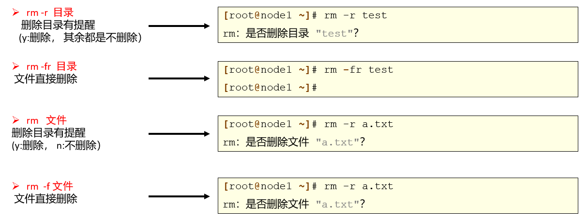

> rm命令在使用时一定要慎重，慎重，在慎重！

网上经常流传这样一个故事 => `rm -rf /*`

rm -rf 强制删除不提示

/根目录

*所有

强制删除根目录下的所有文件 => 跑路

## cp命令(复制)

copy缩写

作用：cp命令用来实现文件或者目录的复制

格式：

```powershell
cp  源文件位置  目标路径
注：如果复制文件可以不需要添加任何参数，但是如果要复制一个文件夹则必须添加一个-r选项代表递归复制
```

案例演示：

```python
touch readme.txt  # 创建一个文件
cp readme.txt /tmp/	 # 把readme.txt文件拷贝到/tmp目录一份

mdkir bigdata  # 创建一个文件夹，也可以放置一些文件在里面
cp -r bigdata /tmp/  # 把bigdata整个文件夹拷贝到/tmp目录
```

## mv命令(剪切或重命名)

move缩写

作用：mv命令用于文件、目录的移动和重命名

格式：

```powershell
mv 源文件路径 目标路径
注意：mv没有任何选项，移动文件和文件夹都可以
```

移动案例演示：

```powershell
touch python.txt
mv python.txt /tmp/   #将python.txt移动到/tmp目录
mkdir bigdata
mv bigdata /tmp/	  #将bigdata文件夹移动到/tmp目录
```

重命名案例演示：

```powershell
mv a.txt b.txt  #将a.txt重命名为b.txt
mv dir2 dir22   #将dir2目录重命名为dir22
```

答疑：涉及到路径中的文件访问，各位小伙伴有一个误解？总是分不清到底什么时候用./或者什么时候用/


答：在Linux操作系统中，要想访问文件有两种路径：绝对路径 和 相对路径；在上方的案例中，我们采用的实际是绝对路径，因为/itcast采用根目录开头。但是我们ls查看的实际上并不是/根目录下的文件，而是当前你所在位置的下的文件信息。也就是说itcast是在当前家目录中，我们要想访问这个文件不应该使用/根目录，因为这是完全不同的路径。

以上写法应该更改为：

```powershell
mv linux.txt ./itcast/
```

## cat命令

扩展：在Shell脚本中，有两个符号（> 和 >>），重定向 => 就是把前面命令的执行结果重定向到某个文件中

```powershell
echo 111 > linux.txt    # 把echo的执行结果输入到linux.txt
echo 222 >> linux.txt   # 把echo的执行结果追加到linux.txt

> 覆盖输出重定向，先清空文件内容，然后把前面的结果输入到文件中
>> 追加输出重定向，不清空文件内容，然后把前面的结果追加到文件的尾部
```

cat命令主要用于查看==小文件==中的文件内容！

作用：用于显示文件内容

格式：

```powershell
cat 文件名称
```

案例演示：

```powershell
echo 111 > linux.txt
echo 222 >> linux.txt

cat linux.txt
```

注：如果不小心，只输入了cat就回车了，系统就会处于等待状态，等待文件的输入，但是由于没有文件，则会导致一直卡在某个位置，如何解决？

答：在Linux操作系统中有一个快捷键 => `Ctrl + C`，在Linux中代表中止当前正在执行的进程。

## more命令

more命令主要用于查看==大文件==中文件内容！（超过多屏）

作用： 用于显示文件内容，可以按页或者按行显示文件内容

格式：

```powershell
more 文件名称

快捷键
Enter: 向下n行, 需要定义, 默认为1行
空格键: 向下滚动一屏 或 Ctrl + F
b键: 返回上一屏 或 Ctrl+B 
q: 退出more
```

案例演示：

```powershell
more /etc/sysctl.conf
```

## ps命令

process缩写 => 进程

作用：ps命令用来列出系统中当前运行的进程

格式

```powershell
ps [options]
```

案例演示：

```powershell
ps -ef #查看正在运行的所有进程
```


==UID ：启动这个进程的UID（用户）编号==

==PID ：关键，代表进程的ID => 每个进程的ID编号都是唯一的==

PPID ：父进程，如果这个值不为0，则代表当前这个进程的父进程编号

C ：CPU占有率

STIME ：启动时间

TTY ：在哪个终端打开的

TIME ：运行时间

==CMD ：进程的名称或者进程的位置==

## kill命令

os.kill(进程PID，发送的信号)

-9：强制杀死进程

-15：正常结束进程

作用：kill命令用于终止执行中的程序

格式：

```powershell
kill [选项] [进程号]
```

案例：

```powershell
测试：可以开两个窗口
第一个窗口运行top命令
第二个窗口通过ps -ef查看进程编号，比如进程号为12345，则在第二个窗口执行以下操作可以结束进程。

kill -9 12345 #强制杀死pid为12345的进程
kill -15 12345 #正常结束pid为12345的进程（默认）
```

## ifconfig命令

在Windows中，我们可以通过ipconfig获取计算机的IP地址；但是在Linux操作系统中，我们可以使用：

ip a 或 ifconfig

作用：ifconfig命令用来查看ip地址

格式：

```powershell
ifconfig
```

案例演示：

```powershell
[root@node1 ~]# ifconfig
ens33: flags=4163<UP,BROADCAST,RUNNING,MULTICAST>  mtu 1500
        inet 192.168.88.100  netmask 255.255.255.0  broadcast 192.168.88.255
        inet6 fe80::20c:29ff:fe49:b3ec  prefixlen 64  scopeid 0x20<link>
        ether 00:0c:29:49:b3:ec  txqueuelen 1000  (Ethernet)
        ...
lo: flags=73<UP,LOOPBACK,RUNNING>  mtu 65536
        inet 127.0.0.1  netmask 255.0.0.0
        inet6 ::1  prefixlen 128  scopeid 0x10<host>
        loop  txqueuelen 1000  (Local Loopback)
        RX packets 90  bytes 17886 (17.4 KiB)
     	...
```

## clear命令

作用：clear命令用来清屏，可以使用`Ctrl + L`来替换

格式：

```powershell
clear
```

案例演示：

```powershell
[root@node1 ~]# clear
```

## 重启与关机命令(超管)

重启：

```powershell
reboot
```

关机：

```powershell
shutdown -h 0 : 立刻关机(断电关机)
halt : 立刻关机 (不断电关机)
```

## which命令

作用：which显示执行命令的绝对位置

在Linux操作系统中，一切皆文件，命令也是一个文件，如果想查看其具体位置，可以通过which语句。

## find命令

作用：根据文件名称或大小搜索文件

```powershell
find / -name "test"

查找小于10KB的文件： find / -size -10k
查找大于100MB的文件：find / -size +100M
查找大于1GB的文件：find / -size +1G
```

## grep命令

作用：对文件内容进行检索

案例演示：

```powershell
grep lang anaconda-ks.cfg 		#在文件中查找lang
grep -n lang anaconda-ks.cfg    #在文件中查找lang并显示行号信息
```

## |管道命令(Shift + \\)

管道作用：就是把|管道前面命令的执行结果作为后面命令的参数

```powershell
# ps -ef | grep crond
```

主要作用就是把当前系统中的所有正在运行的进程查询出来，然后传递给grep命令作为参数

grep  mysql  (正在运行的进程)，又由于grep代表关键词筛选，所以以上完整功能代表在所有正在运行的进程中查找mysql进程！


案例演示：

```powershell
ps  -ef| grep mysql : 在所有进程中快速找到包含mysql内容的进程
```

## tar命令

作用：压缩文件与解压缩文件

```powershell
tar [选项]
```

选项说明：

| 选项 | 解释                                                         |
| ---- | ------------------------------------------------------------ |
| -c   | 创建一个新tar文件，就是把多个文件放在一起，但是没有压缩 => 10M + 10M + 10M |
| -v   | 显示运行过程的信息，显示压缩或者解压缩进度 => 显示进度信息   |
| -f   | 指定文件名，代表指定压缩后的文件名称 => 指定文件名称（必选选项） |
| -z   | 调用gzip压缩命令进行解、压缩，就是把文件压缩为.gz格式 => .gz格式 => xxx.tar.gz |
| -x   | 解包                                                         |

注意：-c和-x正好相反，只能出现一个。-c负责打包，-x负责解压缩

解压：解压缩其实非常简单，只需要把压缩选项中的-c换成-x就可以实现解压缩

```powershell
tar -zxvf redis-3.2.8.tar.gz  			  #将文件解压到当前目录
tar -zxvf redis-3.2.8.tar.gz -C /root/dir #将文件解压到指定目录
简写形式
tar -xf redis-3.2.8.tar.gz  
```

压缩：

```powershell
tar -zcvf test.tar.gz /root/test  		       #打包并压缩
简写形式
tar -zcf test.tar.gz /root/test
多文件压缩
tar -zcvf python.tar.gz linux.txt readme.txt   #把多个文件压缩到同一个压缩包中
```

查看压缩包中的文件：

```powershell
tar -tf redis-3.2.8.tar.gz  # 查看压缩包中的内容
```

## useradd命令(超级命令)

作用：创建账号

案例演示：

```powershell
useradd itheima  # 创建账号
passwd  itheima  # 设置密码
```

扩展：id命令，可以用于查看某个账号是否存在

```powershell
id itheima
```

## userdel命令(超级命令)

作用：删除账号

-r选项：删除用户的同时，删除用户的家目录 => /home/用户名文件夹

案例演示：

```powershell
userdel -r itheima
```

## passwd命令

作用：为Linux用户添加密码，因为默认创建的Linux账号没有密码，Linux出于安全考虑，不允许没有密码的用户登录Linux操作系统。

```powershell
# passwd 用户名称 + 回车
输入密码
确认密码
```

## su命令

作用：切换（用户）账号

```powershell
# su 账号名称
# su - itheima
```

-横岗：代表切换用户的同时，把当前的目录切换到用户的家目录

## chmod命令

作用：更改文件权限


文件权限概述

Linux操作系统是==多任务多用户==操作系统，每当我们使用用户名登录操作系统时，Linux都会对该用户进行认证、授权审计等操作。操作系统为了识别每个用户，会给每个用户定义一个ID，就是UID。为了方便用户管理，Linux允许把多个用户放入一个用户组；在Linux系统中，用户组也有一个ID，GID。


用户和用户组的概念

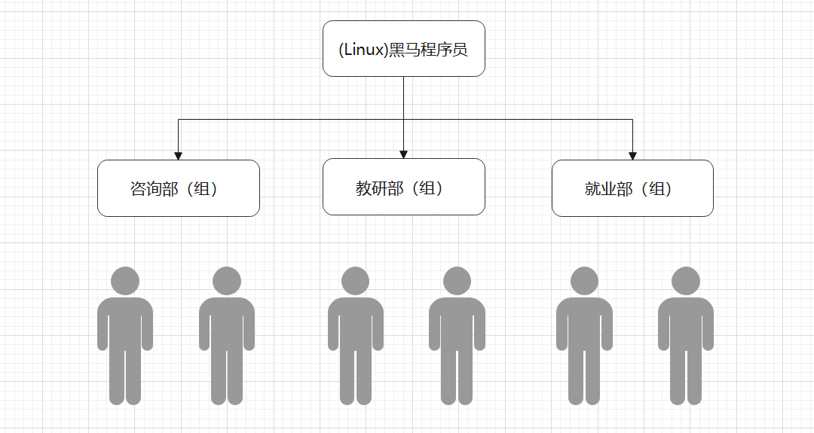


在Linux操作系统中，root的权限是最高的，相当于windows的administrator，拥有最高权限，能执行任何命令和操作，而其他用户都是普通用户。

Linux对文件创建者（所属用户），所属用户组，其他用户都赋予不同的权限。

查看文件权限

```powershell
# ls -l
```

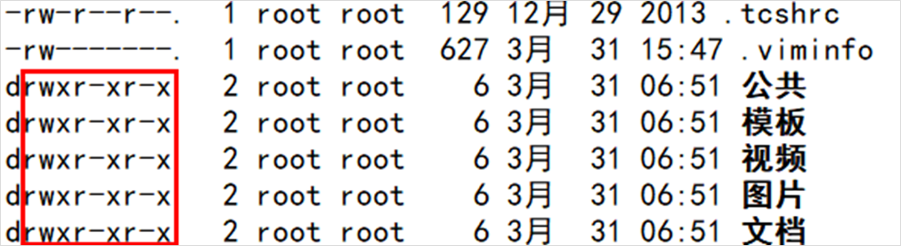

文件权限解读

r/w/x

r：只读权限

w：只写权限

x：主要针对脚本文件，如.sh脚本文件，代表可以对其进行运行 => 类似Windows中的.exe


第1个小列：文件类型，-是一个普通文件，d代表是一个文件夹

第234个小列：文件拥有者权限

第567个小列：所属组内用户权限

第8910个下列：其他用户权限（既不是拥有者也不是组内用户）


==r: 对文件是指可读取内容，对目录是可以读目录下的文件信息==

==w: 对文件是指可修改文件内容，对目录 是指可以在其中创建或删除子节点(目录或文件)==

==x: 对文件是指是否可以运行这个文件，对目录是指是否可以cd进入这个目录==

> 在文件夹中，r和x权限一般属于组合权限，通常是一起出现的，很少单独出现。

> 注意：以上r、w、x权限都只能针对普通用户，root可以为所欲为，因为其不受权限限制。

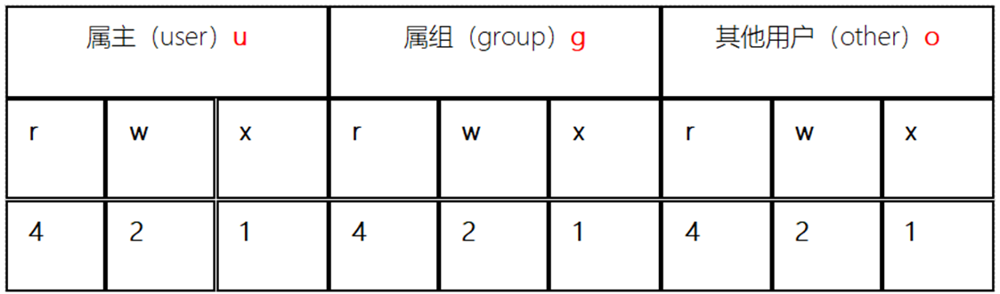

chmod命令：chmod命令用来变更文件或目录的权限。

chmod命令可以通过==字母修改文件权限==，也可以通过==数字方式修改文件权限==。

字母形式：

```powershell
# chmod u=rwx,g=rx,o=rx 文件名称
或
# chmod -R u=rwx,g=rx,o=rx 文件夹
-R：递归修改，不仅可以修改文件夹本身的权限，还可以修改文件夹内部的所有文件权限

还可以使用+或-修改权限：
# chmod u-x 文件名称

如果针对u、g、o三者设置相同权限，我们还可以使用a来替代ugo
# chmod a=rwx 文件名称
```


数字形式：常见数字权限，777、755、644、600，这些都是文件权限。必须3位连续的数字。

第1位数字u：拥有者权限

第2位数字g：组内用户权限

第3位数字o：其他用户权限


思考一个问题：数字从何而来？

答：每一个权限都有一个对应的数字，==r=4、w=2、x=1==

思考一个问题：数字7、6、5怎么来的？

答：通过4、2、1相加得到

7 = 4 + 2 + 1 = r w x

6 = 4 + 2 = r w

5 = 4 + 1 = r x


## Linux快捷键Ctrl + C

Windows中：Ctrl + C代表复制

Linux中：Ctrl + C不代表复制，而代表中止当前正在运行的程序

## 用户组与用户操作

用户组创建：

```powershell
groupadd 用户组名称

tail -1 /etc/group   # 代表查看一个文件的最后10行，如果指定了选项，则代表显示最后的指定行
```

用户组删除：

```powershell
groupdel 用户组名称
```

把某个用户添加到某个用户组

```powershell
useradd 用户名称 -g 组名称
```

## history命令

作用：查看当前终端中，之前输入的指令信息

## man命令（求帮助）

manual缩写，代表手册、文档

```powershell
# man tar
```

退出，按q

## 几个好用的快捷键

Tab键：针对命令或路径，具有提示功能（按1次或按2次）

方向键上和下，查看上一个输入的或者下一个输入的Linux指令


# 七、Linux的vi/vim编辑器（重点）

vim改配置文件或者把其他的地方的配置拷贝到Linux系统中，一定一定要记得在插入模式下粘贴！！

## vi/vim编辑器介绍

vi是visual interface的简称, 是Linux中最经典的文本编辑器（Windows中的记事本）

vi的核心设计思想：让程序员的手指始终保持在键盘的核心区域, 就能完成所有编辑操作

vi的特点：

* 只能是编辑文本内容, 不能对字体段落进行排版
* 不支持鼠标操作
* 没有菜单
* 只有命令

vim 是从vi发展出来的文本编辑器, 支持代码补全、编译及显示效果等方面编程的功能提别丰富, 在程序员中被广泛使用, 被称为编辑器之神。


## 打开文件

```powershell
vi a.txt          #直接打开文件
vim a.txt         #vim是vi的增强版
vim +10 a.txt  	  #直接打开文件，并定位到第10行
```

## VIM编辑器的三种模式

在Vi/Vim编辑器中，一共有3种工作模式：==命令模式、插入模式（编辑模式）、末行模式（底行模式）==

==命令模式：复制、粘贴、移动光标、撤销与恢复== 

==插入模式（编辑模式）：只能编辑文件内容（写字）== =>  i => insert

==底行模式（末行模式）：保存文件、退出文件、显示行号、搜索关键词==


## 命令模式相关命令

当我们通过vim命令打开文件时，默认就处于==命令模式==

> 小技巧：进入vim编辑器，先查看左下角有没有提示信息，如果没有任何信息，代表你当前位于命令模式！

| **命令** | **功能**                                                     |
| -------- | ------------------------------------------------------------ |
| o        | 在当前行后面插入一空行，除此以外，也会从命令模式切换到输入模式 |
| O        | 在当前行前面插入一空行，除此以外，也会从命令模式切换到输入模式 |
| ==dd==   | 剪切或删除光标所在行（本质是剪切，但是如果剪切后不粘贴，则代表删除） |
| ndd      | 从光标位置向下连续剪切或删除 n 行                            |
| ==yy==   | 复制光标所在行                                               |
| nyy      | 从光标位置向下连续复制n行                                    |
| ==p==    | 粘贴                                                         |
| ==u==    | 撤销上一次命令，相当于Windows中的Ctrl + Z                    |
| ==gg==   | 回到文件顶部                                                 |
| ==G==    | 回到文件末尾                                                 |
| Ctrl + R | 恢复，与u相对应                                              |

## 编辑模式相关操作

如何进入编辑模式呢？

答：按i（insert）、a（append）

i：在当前光标的前面插入内容

a：在当前光标的后面插入内容

o：在光标的后一行插入内容

O：在光标的前一行插入内容


问题：如何从编辑模式回到命令模式

答：按Esc键

## 底行模式相关命令

重点记住3个字母即可，:w、:q、！

==在Linux操作系统中，文件必须先保存后退出！==

！叹号代表强制，强制保存、强制退出、强制保存并退出！

| **命令**     | **功能**                            |
| ------------ | ----------------------------------- |
| :w  文件     | 另存为                              |
| ==:w==       | 保存(ctrl + s)                      |
| ==:q==       | 退出, 如果没有保存,不允许退出       |
| :q!          | 强行退出, 不保存退出                |
| ==:wq==      | 保存并退出                          |
| :x           | 保存并退出                          |
| ==:set  nu== | 设置行号，取消行号使用==:set nonu== |
| :noh         | 取消高亮                            |
| /关键词      | 搜索某一关键词                      |

:wq和:x区别？

答：

如果文件内容有改变，两者的效果是一样的。

如果文件内容没有改变，:x不会改变文件的最后修改时间，但是:wq会更新文件的最后修改时间。

## Vim常见错误E325处理流程

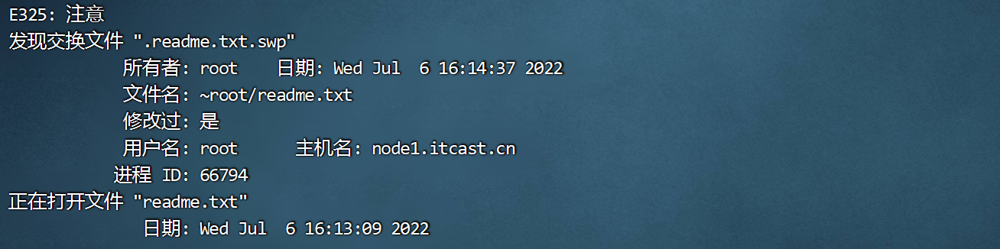

如果在打开某个文件时，弹出以上提示，那代表你这个文件之前没有保存就强制退出了，触发了Vim的备份机制，产生了一个xxx.swp交换文件。

以后每次打开之前的文件就会产生上面的提示，解决方案：

① 之前的修改不重要，可以直接删除的情况

直接回车，切换到错误的底部，然后按q，直接退出，然后执行删除操作

```powershell
# rm .源文件名称.swp
```


② 之前的修改很重要，需要先恢复内容，然后再解决报错问题

第一步：直接回车，切换到错误的底部，找到回复菜单，一般是r，恢复文件内容

第二步：针对找回的内容进行:wq保存并退出

第三步：删除刚才产生的交换文件

```powershell
# rm .源文件名称.swp
```

## 小结

了解VIM编辑器的三种模式


# 八、Linux系统下如何安装软件（必备）

## Linux下软件安装方式

rpm包管理

yum在线安装（重点掌握）

## yum包管理工具（在线安装）

必须要有网络支持

配置yum源，就是说下载软件要从哪里下载？

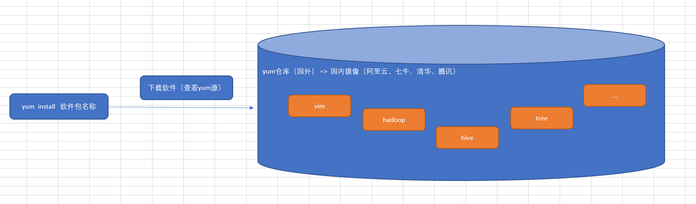

安装腾讯的yum源：

官方地址：https://mirrors.cloud.tencent.com/

```powershell
# mv /etc/yum.repos.d/CentOS-Base.repo /etc/yum.repos.d/CentOS-Base.repo.backup
# wget -O /etc/yum.repos.d/CentOS-Base.repo http://mirrors.cloud.tencent.com/repo/centos7_base.repo
```

扩展：国内做的比较好的镜像站

① ==阿里云== ② ==腾讯云== ③ ==清华镜像站== ④ 七牛云 ⑤ 豆瓣镜像站

更新缓存：

```powershell
yum clean all
yum makecache
```

## yum实现软件安装、更新与卸载

搜索与卸载软件

```powershell
# rpm -qa |grep vim
# rpm -e vim-common-7.4.629-8.el7_9.x86_64 --nodeps
# rpm -e vim-enhanced-7.4.629-8.el7_9.x86_64 --nodeps

注：
rpm -qa，-q查询，-a所有，查询所有已安装软件
rpm -e 软件包完整名称，正常卸载软件，添加--nodeps就代表强制卸载操作
rpm最大问题，安装或卸载软件时存在依赖关系 => A软件 => B软件 => C软件 => D软件
```

搜索软件

```powershell
# yum search 软件包名称

yum search vim
```

安装软件

```powershell
基本语法：
# yum install 软件名称（只写名字不需要写版本） -y
如果不写-y，默认会提示，是否需要安装，必须回y，才能继续安装

# yum install vim -y
选项：
-y：确认，直接安装不提示

# yum install tree -y
# tree /tmp
```

卸载软件

```powershell
# yum remove 软件包名称 -y
选项：
-y：确认，直接卸载不提示

# yum remove tree -y
```
